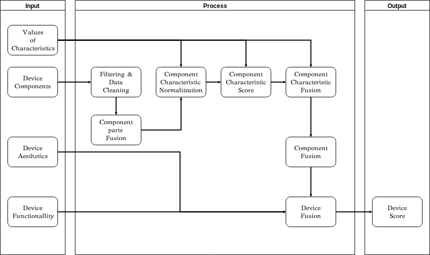

# RdeviceScore

The RdeviceScore algorithm is a logical step-by-step method to solve the problem of estimating the value of use of a desktop and laptop computer equipment in next Figure 6.

## Introduction 

Device owners nowadays decide if and when a digital device be comes ewaste, or is still usable for reuse. In a device as a commons model, where devices are collectively owned and managed, we propose to restrict this individual choice in favour of collective choice. This is achieved through external and internal organisational and governance instruments for a commons-based cooperative platform,
that has developed over the last three years handing more than 700
computers. As part of that governance, we present the Circular Prod-
uct License, where the ownership of a device is not linked to the
first individual user, but resides in a community or organisation
responsible for safeguarding its reuse, ensuring that a pool of de-
vices, as a commons, will maximise its lifetime through multiple
reuse cycles. Each device will only be recycled when the demand and
reuse potential for it has been exhausted. Another is an algorithm to
estimate the use value of the devices, such as laptops and desktops.
The algorithm computes the value of use of the device. When this
value is too low or has no demand, the community in custody obtains
the recycling permission, or otherwise another cycle of reuse begins.
These open source tools, as part of the eReuse.org platform bring
automation, cost reduction, traceability and auditability in all the
steps in the lifetime of any device included in the commons, across
manufacturing, use, reuse, repair, refurbishment and final recycling.

## Algorithm

### Input

The entry contains the main characteristics of a device that are: i) the components it has, such as processor, storage and ram memory, ii) the aesthetics or appearance, which is a categorical variable, now defined subjectively with values such as: “A: The device is new”, “B: really good condition (small visual damage in difficult places to spot)”, “C: good condition (small visual damage in parts that are easy to spot, not on screens)”, etc., (iii) and functionality, another categorical and subjective variable, such as: “A. Everything works perfectly (buttons, and in case screens there are no scratches)”, “B. There is a button difficult to press or a small scratch in an edge of a screen”, etc. At the same time, each component has a set of features such as processor speed, number of processor cores, processor score according to benchmarks, disk size and read/write speeds, or ram size and speed. 

The usage value of a product varies over time, for example, in year 2018 computers that do not have at least one dual core processor and 1 GB of RAM are not suitable for using an operating system and the most common applications. Therefore, the algorithm needs to access
up-to-date information with reference values for each component to estimate the current value for a device. This information is in the “[Values of characteristics table] (./data/models.csv)).

This table is calculated periodically on the basis of data from devices in circulation managed by platforms and organisations reporting to the eReuse data pool. For each component, its normal distribution is calculated and the minimum acceptable values are set. The minimum acceptable value is represented by xMin, lower values add up to 0 in the component valuation, and the maximum value per xMax, higher values add up to the maximum allowed by the component.

The chosen percentile is recorded for each value, the main percentile is min, p5, p50, p75, p90, p95, max. For example, in the table the drive.size.xMax value has a value of 265,000 MB set for the percentile p90, this means that if we process a disk with this size, it will normalise to a value of 1, the same as if the disk has 500 GB. If the drive.size.xMin value is 4MB and the device is 4MB in size, that results in a value of 0.

### Process
**Step Filtering & Data Cleaning**

*Filtering*: Platforms manage diverse electronic devices such as televisions, printers, etc, the algorithm should filter the input only by accepting desktop and laptop type devices.
*Data cleaning*: The input with the description of the device components needs to be prepared for input to the algorithm. For example, if a device does not have disk the input is a null value that must be converted to 0.

**Step Component Parts Fusion**
There are components that are divided into what we call parts, such as RAM memory, which may have several memory cards or there may be several hard disks. The algorithm must merge them and treat them as a single component. In the case of size variables, we add the parts. For example, if we have two 100 GB disks, the result of the drive. size variable will be 200 GB. For example, if we have two RAM cards, one with 2GB and 100MB/speed, and the other with 4GB and 200MB/speed, the merger will result in a 6GB with 166MB/speed.

## Installation
### Instalation in Debian 9

See manual: https://cran.r-project.org/bin/linux/debian/

git clone github.com/eReuse/RdeviceScore
install R Language:
apt-get update
apt-get install r-base
sudo apt-get install libcurl4-gnutls-dev

### Install a github package

install.packages("githubinstall")

### Install R

https://cran.r-project.org/src/base/R-3/R-3.3.3.tar.gz

cd R-2.15.3/

./configure –enable-R-shlib

#if problems
./configure –enable-R-shlib –with-readline=no –with-x=no

make clean

make

make install

# ensure installed
ls /usr/local/bin |grep R

# install devtools 

apt-get -y build-dep libcurl4-gnutls-dev
apt-get -y install libcurl4-gnutls-dev

